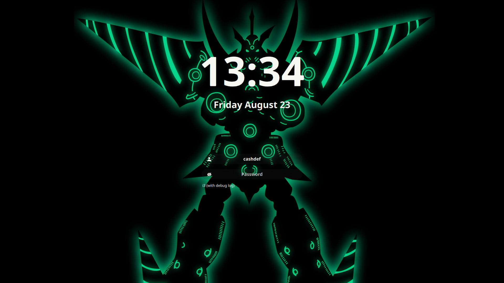

# sddm-gl

A theme for the [SDDM login manager](https://github.com/sddm/sddm).

- Screen resolution: 1080p
- Font: Noto sans

### Preview

You can easily change how it looks in **[config](./theme.conf)**. 
Here are some examples:



### Dependencies

```sh
qt6-5compat qt6-declarative qt6-svg sddm noto-fonts
```
> qt6-declarative replaces qt6-quickcontrols2
> https://archlinux.org/packages/extra/x86_64/qt6-declarative/

### Install

1. Clone repo to `/usr/share/sddm/themes/`:

    ```sh
    sudo git clone https://github.com/CashDeficiency/sddm-gl.git /usr/share/sddm/themes/sddm-gl
    ```

2. Set theme in `/etc/sddm.conf`:

    ```sh
    echo -e "[Theme]\nCurrent=sddm-gl" | sudo tee /etc/sddm.conf
    ```

### Credits

Based on the theme [`Sugar Dark for SDDM`](https://github.com/MarianArlt/sddm-sugar-dark) by **MarianArlt**.

Forked from theme [`sddm-astronaut-theme`](https://github.com/Keyitdev/sddm-astronaut-theme) by **Keyitdev**.

### License

Distributed under the **[GPLv3+](https://www.gnu.org/licenses/gpl-3.0.html) License**.    
Copyright (C) 2018 Marian Arlt.
Copyright (C) 2022-2024 Keyitdev.
Copyright (C) 2024 CashDeficiency.
